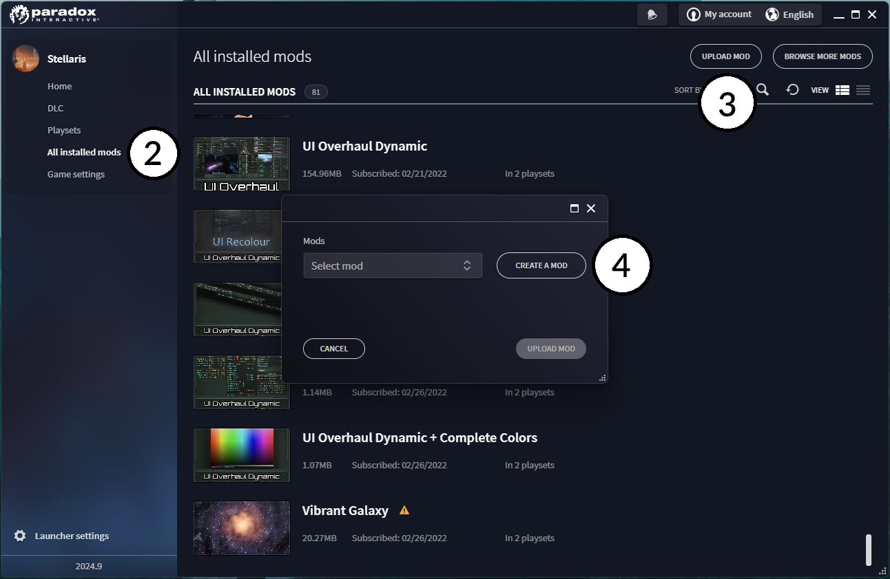
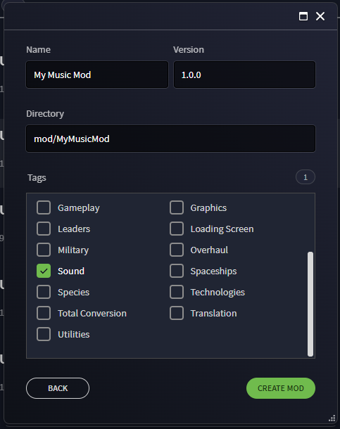
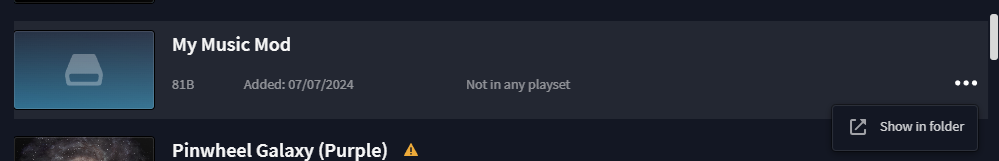
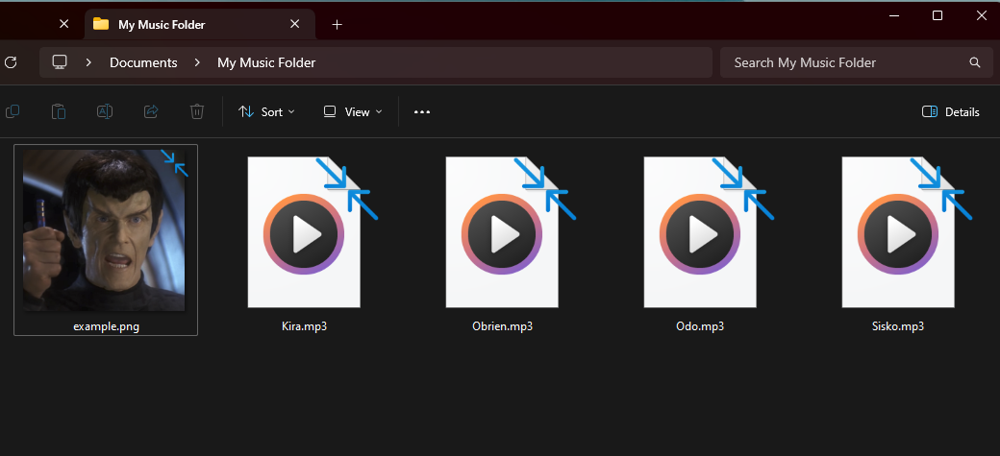
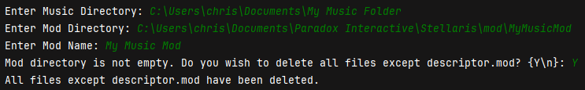
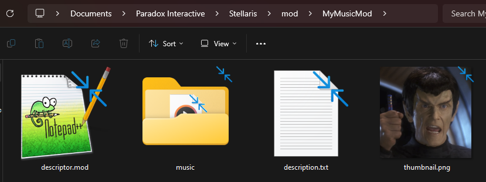
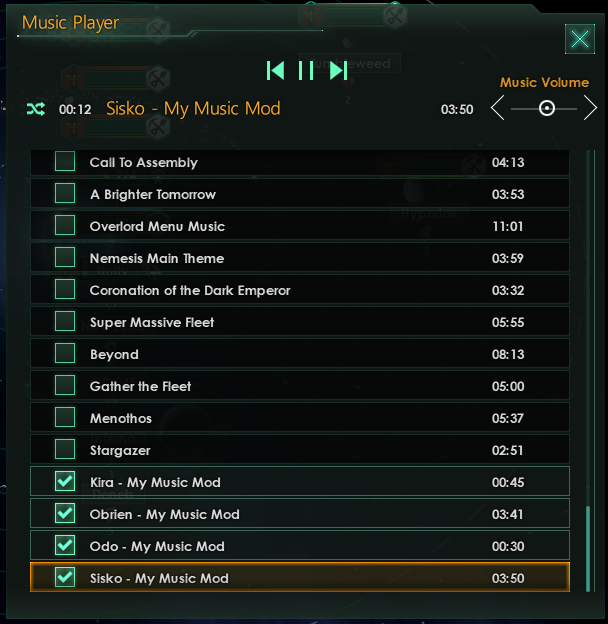

# Stellaris Music Mod Maker

Author: nop990

<figure>

<figcaption>Credit: Marcela Laskoski on Unsplash</figcaption>
</figure>

## Disclaimer

> :radioactive: **This tool was made for fun in one night and may contain bugs. I humbly request that you do not use
stolen music or illegally infringe copyright with this tool. :radioactive:**

## Instructions

### Generate Mod using Stellaris Launcher

1. Run the Stellaris launcher
2. Go to the "All Installed Mods"
3. Click "Upload Mod"
4. Click "Create Mod"

5. Fill out the fields with whatever you want and click "Create Mod" to save your mod locally
6. (Optionally) Upload your mod to the Steam Workshop and/or Paradox Mods
7. Go back to the "All Installed Mods" tab in the launcher and click the three dots next to your created mod, which
   should now be in the list.

8. Click "Open Mod Folder" and set the window aside for now.

### Set up Music folder

1. Create a folder anywhere you want, and put the music files you want in your mod in it. These can be .flac, .mp3,
   .wav, .ogg, or a mix of the 4.

> **If all of your music is .ogg format, the program will automatically skip the conversion step.**

2. (Optional) Include a 500x500px image file that will serve as the thumbnail for your mod. This can be a .png, .jpg, or
   .jpeg file. If no image is included, the program will use a default image that you probably will not like.
3. Set the window aside for now.

### Download and use the Stellaris Music Mod Maker

1. Download the Stellaris Music Mod Maker from the [Releases]() page.
2. Extract the contents of the zip file to a folder.
3. Run the `SMMM.exe` file. Windows Defender will warn you about running an unknown program. If you trust me, click "
   More Info" and then "Run Anyway" to proceed.
4. Copy the path to the folder containing your music.
5. Copy the path to the folder of your generated Stellaris mod. This is usually in your documents/Paradox
   Interactive/Stellaris/mod folder.
6. Type the name of your mod. This is how it will display next to each track in-game.

7. If you are using a mod directory that already had stuff in it, the program will ask you if you want to delete those
   files. You will need to, to proceed.
8. If one or more of your tracks has no track number, the program will ask you if you want to add them. If not, the
   program will sort tracks with missing numbers to the end of the list.
9. When the program finishes, it should open a new file explorer window with your mod directory. You should see a music
   folder with all of your music files in it, a songlist.asset, and a songlist.txt. In the main directory, you should
   see your descriptor.mod file generated by the Stellaris launcher, a description.txt generated by the program, and
   either your thumbnail or the default.
> **The description.txt file will not automatically be imported by the Stellaris launcher, you will need to manually copy/paste its contents into the upload dialog box**
10. Add the mod to your playset in the Stellaris launcher and test that everything works as expected.
11. If you are publishing your mod, use the "Upload Mod" you used earlier and select your mod from the dropdown to
    update it.
> **Please credit any artists whose music you use in your mod.**

 
